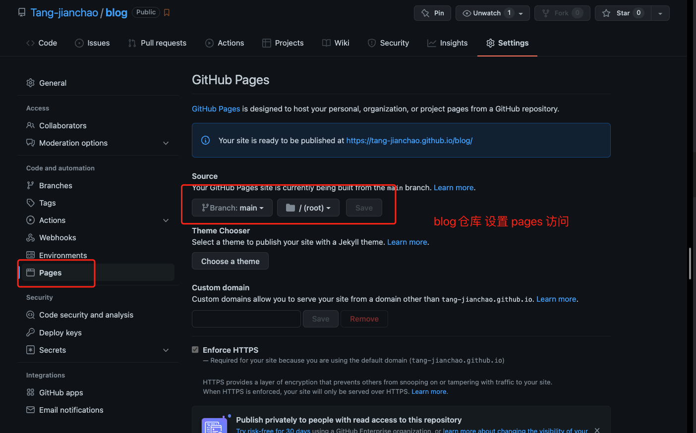

---

title: Github静态站点子路径部署项目

---

### github站点包含多个子项目

> 希望通过github部署的个人站点，能够支持不同目录访问到不同的项目。
> 例如: https://tang-jianchao.github.io/ 首页
> https://tang-jianchao.github.io/blog/ 博客
> https://tang-jianchao.github.io/projectA 项目A
> https://tang-jianchao.github.io/projectB 项目B

1. ### xxx.github.io 根路径

   https://github.com/Tang-jianchao/Tang-jianchao.github.io 仓库中仅仅保留一个index.html文件用于  https://tang-jianchao.github.io/  根路径访问。

   

2. ### blog子路径

   在hexo搭建的博客项目中, 修改  _config.yml 文件中的内容:

   ```xml
   # URL
   # 这里的url是要访问blog的地址
   url: https://tang-jianchao.github.io/blog 
   # 这里需要设置hexo的根路径 构建之后 项目引用的资源才能正确找到
   root: /blog/
   permalink: :year/:month/:day/:title
   
   ......
   
   deploy:
     type: git
     repo: https://github.com/Tang-jianchao/hexoProject.git
   	# 该分支专门用来存放 静态资源
     branch: gh-pages 
     message: init
   ```

   执行 ` npm run deploy` 命令后, hexo 会把构建后的内容推送到当前仓库的 `gh-pages` 分支 

   GitHub 会默认把该分支作为  github站点子路径的访问来源

   如果想用其他分支作为来源就需要修改（在设置过程中，遇到了只有 public 的仓库 才可以设置的情况 ）: 

   **blog- setting - pages**  设置 **github Page** 选择当前的分支  **Save**

   

   验证: https://github.com/Tang-jianchao/blog 

   

3. Project

   和 blog仓库原理相同, 不同的地方是需要手动部署项目。

   创建 gh-pages 分支 构建好之后 只提交构建后的产物  并在仓库中 设置好github pages的分支来源

   注意 正确设置 publicPath的路径， 例如 这里以 为例 所以设置 publicPath: /project/

   后续考虑 借鉴 hexo 一键部署的思路来发布子项目

   验证: https://github.com/Tang-jianchao/vue-admin

   
